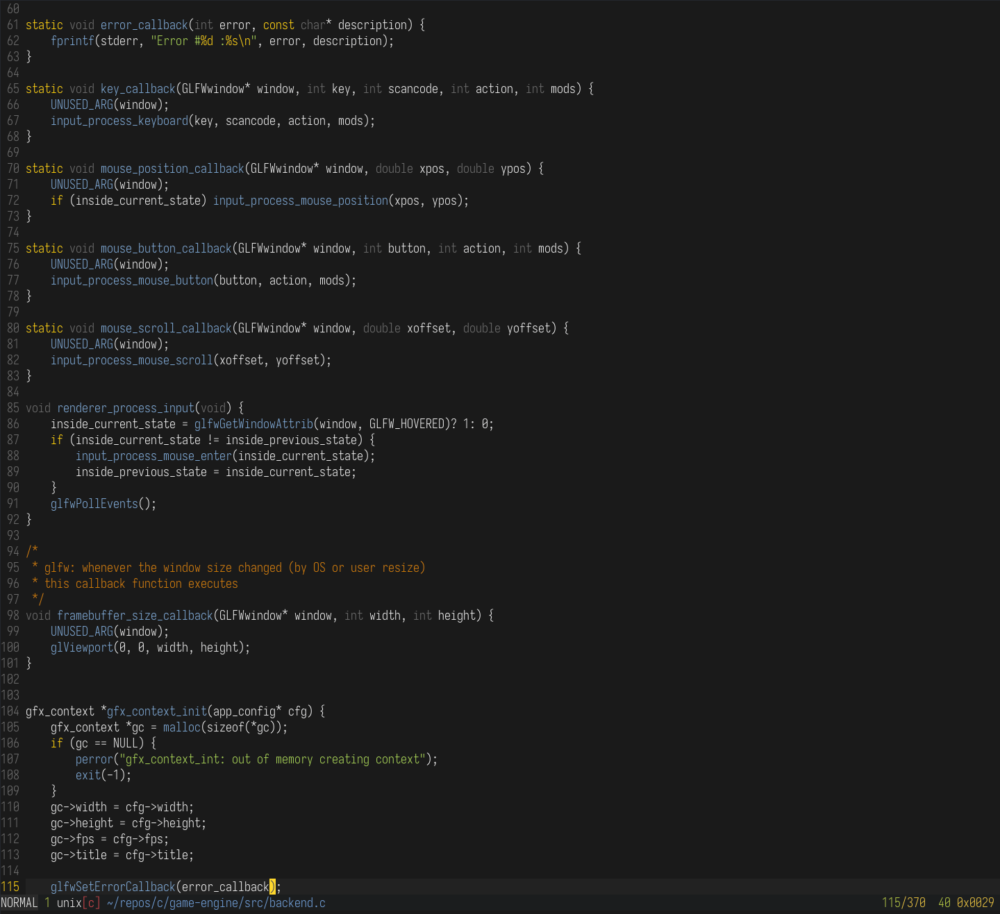

<div align="center">
  

  # Gruber Ocean

  A minimal Vim color scheme based on Gruber Darker with custom enhancements.
</div>

## Why Gruber Ocean?

I wanted a color scheme that:
- Keeps types subtle (not distracting)
- Makes functions stand out with cyan
- Maintains the minimal philosophy of Gruber Darker
- Automatically highlights custom C types (camera_t, vec3_t, etc.)

## Features

- **Minimal syntax highlighting** - inspired by Tsoding's setup
- **Darker types** - subtle gray for type names (matches line numbers)
- **Cyan function names** - soft muted cyan for better readability
- **Keywords in yellow** - clear keyword visibility
- **Strings in green** - easy to spot string literals
- **Auto-highlighting** - custom types ending in `_t` or `_s` automatically highlighted

## Color Palette

- Background: Very dark gray (almost black)
- Normal text: Bright white
- Types: Gray (243) - same as line numbers
- Keywords: Yellow (220)
- Strings: Green (149)
- Functions: Muted cyan (110)
- Comments: Brown/orange (172)

## Installation

### Using vim-plug

```vim
Plug 'ruscito/gruber-ocean'
```

### Using Vundle

```vim
Plugin 'ruscito/gruber-ocean.vim'
```

### Manual Installation

1. Download `gruber-ocean.vim`
2. Copy it to `~/.vim/colors/`
   ```bash
   mkdir -p ~/.vim/colors
   cp gruber-ocean.vim ~/.vim/colors/
   ```

## Usage

Add this to your `.vimrc`:

```vim
colorscheme gruber-ocean
```

## Screenshots



## Language Support

Specific highlighting for:
- C/C++
- Rust
- Python
- Go
- JavaScript
- HTML/CSS
- Markdown
- Lua

## Credits

Based on the [Gruber Darker](https://github.com/blazkowolf/gruber-darker.nvim) color scheme, which itself is inspired by [Alexey Kutepov (Tsoding)'s](https://github.com/rexim) Emacs setup.

## License

MIT License - feel free to use and modify!
